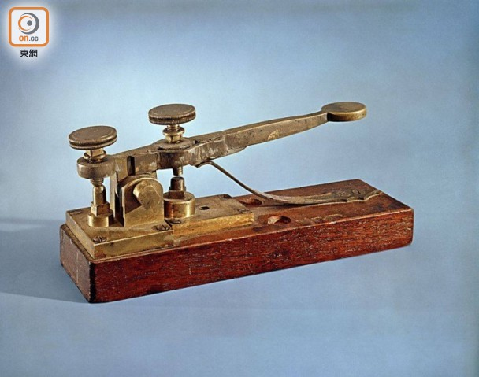

# 摩尔斯电码介绍

摩尔斯电码是美国人摩尔斯于1844年发明的。

最早的摩尔斯电码是一些表示数字的点和划。数字对应单词，需要查找一本代码表才能知道每个词对应的数。用一个电键可以敲击出点、划以及中间的停顿。

虽然摩尔斯发明了电报，但他缺乏相关的专门技术。他与Alfred Vail签定了一个协议，让他帮自己制造更加实用的设备。Vail构思了一个方案，通过点、划和中间的停顿，可以让每个字符和标点符号彼此独立地发送出去。他们达成一致，同意把这种标识不同符号的方案放到摩尔斯的专利中。这就是现在我们所熟知的美式摩尔斯电码，它被用来传送了世界上第一条电报。

掌握一点摩尔斯电码的基本知识，在关键时刻肯定会有用的，好了，让我们一起共同学习吧！
```
A*- 
B-*** 
C-*-* 

D-** 
E* 
F**-* 

G--* 
H**** 
I** 

J*--- 
K-*- 
L*-** 

M-- 
N-* 
O--- 
P*--* 
Q--*- 
R*-* 
S*** 

T- 
U**- 
V***- 

W*-- 
X-**- 
Y-*-- 
Z--** 

0 ----- 

1 *---- 

2 **--- 
3 ***-- 
4 ****- 
5 ***** 
6 -****
7 --***
8 ---** 
9 ----* 

， --**-- 
。 *-*-*- 
? **--** 
“” *-**-* 
! **--* 
```

## 注： 
1. 划一般是三个点的长度；点划之间的间隔是一个点的长度； 
2. 字符之间的间隔是三个点的长度；单词之间的间隔是七个点的长度。 
3. -- --- *-* *** * / -*-* --- -** * 
DahDah DahDahDah DitDahDit DitDitDit Dit, DahDitDahDit DahDahDah DahDitDit Dit. 
4. 时间控制和表示方法 
有两种"符号"用来表示字符：点和划，或叫滴(Dit)和答(Dah)。点的长度决定了发报的速度，并且被当作发报时间参考。下面是时间控制的图标： 
```
-- --- *-* *** * / -*-* --- -** * 
//M O R S E (空白) C O D E 
```
这里，-表示划，*表示点。这是上面消息的准确发报时间(=表示信号有，.代表信号无，每个为一个点的长度): 
===.===...===.===.===...=.===.=...=.=.=...=.......===.=.===.=...===.===.=== 
^ ^ ^ ^ ^ 

| 划 点 | 单词间隔 
点划间隔 字符间隔 

## 常用缩写：

```
SOS *** --- *** international distress call（求救） 
CQ --** --*- Calling any station（呼叫任何人） 
SK *** -*- 再见 
AR *-*-* 停止 (消息结束) 
AS *-*** 等待 
K -*- 邀请发射信号(一般跟随AR，表示“该你了”) 
SK ***-*- 终止 (联络结束) 
GM --* -- Good morning 
GA --* *- Good afternoon or Go ahead (depending on context) 
GE --* * Good evening 
GUD --* **- -** Good 
C -*-* Yes 
U **- You 
SRI *** *-* ** Sorry 
```

英文“I LOVE YOU”摩尔斯电码如下：
> ** *-** --- ***- * -*-- --- **-

中文“我爱你”摩尔斯电码如下：
```
我2053 ，**--- ----- ***** ***--
爱1947 ，*---- ****- ****- --***
你0132 ，----- *---- ***-- **---
```